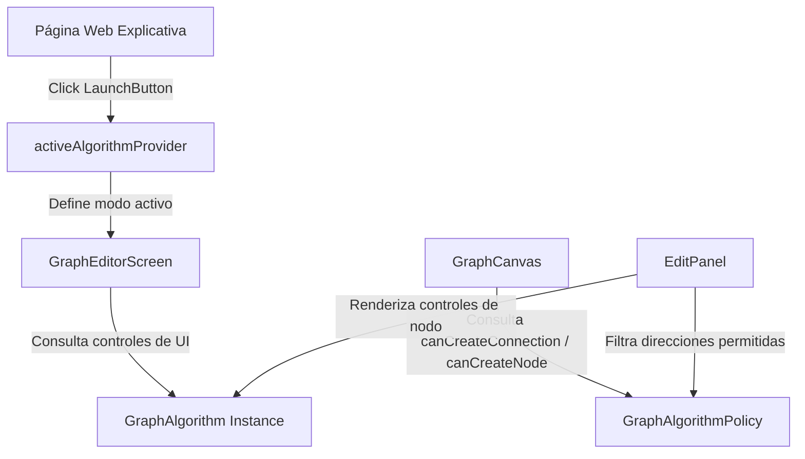

# Arquitectura Modular de Algoritmos y Restricciones de Dibujo

Esta guía documenta la arquitectura desacoplada basada en **Riverpod** y contratos de dominio para la integración de algoritmos de teoría de grafos, sus restricciones de dibujo en tiempo real sobre el lienzo y sus componentes visuales específicos.

---

## 1. Visión General

La arquitectura separa estrictamente:
1. **El Motor de Dibujo y Lienzo (`GraphCanvas`)**: Es agnóstico a cualquier algoritmo concreto. Consulta dinámicamente la política del algoritmo activo (`GraphAlgorithmPolicy`) antes de permitir cualquier mutación (creación de nodos, aristas, bucles o cambios de dirección).
2. **El Algoritmo Específico (`lib/algorithms/<nombre>/`)**: Cada algoritmo encapsula su lógica matemática, sus modelos, su validador, su política de dibujo restrictiva y sus widgets visuales (botón de lanzamiento para la web, controles sobre el lienzo, tarjeta de resultados y edición en el panel de propiedades).
3. **El Registro Central (`AlgorithmRegistry`)**: Lista los algoritmos disponibles y expone a través de Riverpod el algoritmo activo en el entorno de trabajo (`activeAlgorithmProvider`).



---

## 2. Estructura de Directorios Recomendada

Cada algoritmo se aloja de forma autocontenida dentro de `lib/algorithms/<nombre_algoritmo>/`:

```
lib/algorithms/
├── core/
│   ├── graph_algorithm.dart         # Contrato base abstracto de algoritmos y políticas
│   └── algorithm_registry.dart      # Registro y providers Riverpod (activeAlgorithmProvider)
│
├── assignment/                      # Algoritmo de Asignación (Método Húngaro)
│   ├── assignment_algorithm.dart    # Implementación de GraphAlgorithm
│   ├── domain/
│   │   ├── models/                  # Modelos de matriz y asignación
│   │   ├── policy/                  # AssignmentGraphPolicy (Bipartito, Origen -> Destino)
│   │   ├── services/                # Validador y extractor de matrices
│   │   └── solvers/                 # Solver húngaro O(n^3)
│   ├── providers/                   # Notifiers de Riverpod
│   └── ui/
│       ├── assignment_launch_button.dart   # Botón dedicado para la página web
│       ├── assignment_canvas_controls.dart # Selector flotante [ + Origen | + Destino ]
│       └── assignment_algorithm_card.dart  # Tarjeta de solución y cálculo
│
└── johnson/                         # Algoritmo de Johnson (Ruta Crítica / CPM)
    ├── johnson_algorithm.dart       # Implementación de GraphAlgorithm
    ├── domain/
    │   ├── models/                  # Modelos CPM, tiempos y holguras
    │   ├── policy/                  # JohnsonGraphPolicy (DAG, sin ciclos hacia atrás)
    │   ├── services/                # Validador DAG Kahn
    │   └── solvers/                 # Forward/backward pass
    ├── providers/                   # Notifiers de Riverpod
    └── ui/
        ├── johnson_launch_button.dart   # Botón dedicado para la página web
        ├── johnson_canvas_controls.dart # Badge de estado DAG sobre el lienzo
        └── johnson_algorithm_card.dart  # Tarjeta de actividades y ruta crítica
```

---

## 3. Contratos Centrales

### 3.1 `PolicyResult`
Representa la decisión de una regla de dibujo:
```dart
class PolicyResult {
  final bool allowed;
  final String? message;

  const PolicyResult.allow();
  const PolicyResult.deny(String reason);
}
```

### 3.2 `GraphAlgorithmPolicy`
Define qué operaciones sobre el grafo están permitidas o prohibidas:
```dart
abstract class GraphAlgorithmPolicy {
  /// Valida si se puede crear un nodo en las coordenadas dadas.
  PolicyResult canCreateNode(Grafo grafo, double x, double y, {Map<String, dynamic>? params});

  /// Construye y prepara la instancia de Nodo (asignando roles, nombres por defecto, colores, etc.).
  Nodo prepareNewNode(Grafo grafo, double x, double y, {String? nombre, int? colorValue, Map<String, dynamic>? params});

  /// Valida si se permite conectar origenId -> destinoId con la dirección indicada.
  PolicyResult canCreateConnection(Grafo grafo, String origenId, String destinoId, Direccion direccion);

  /// Direcciones que el usuario puede elegir para una conexión (ej. solo unidireccional).
  List<Direccion> allowedDirections(Grafo grafo, String origenId, String destinoId);

  /// Si permite bucles sobre el mismo nodo.
  bool get allowSelfLoops;

  /// Si permite conexiones bidireccionales.
  bool get allowBidirectional;
}
```

### 3.3 `GraphAlgorithm`
Integra metadatos del algoritmo, su política y sus hooks de interfaz gráfica:
```dart
abstract class GraphAlgorithm {
  String get id;
  String get name;
  String get shortName;
  String get description;
  IconData get icon;
  Color get themeColor;
  GraphAlgorithmPolicy get policy;

  /// Botón para incrustar en la web explicativa.
  Widget buildLaunchButton(BuildContext context, WidgetRef ref);

  /// Controles flotantes sobre el lienzo (ej. alternador Origen/Destino).
  Widget? buildCanvasControls(BuildContext context, WidgetRef ref) => null;

  /// Tarjeta de resultados flotante cuando el grafo es válido.
  Widget? buildAlgorithmCard(BuildContext context, WidgetRef ref) => null;

  /// Controles adicionales al seleccionar un nodo en EditPanel.
  Widget? buildNodeEditControls(BuildContext context, WidgetRef ref, Nodo nodo) => null;
}
```

---

## 4. Comportamiento de los Algoritmos Implementados

### 4.1 Algoritmo de Asignación (`AssignmentGraphPolicy`)
- **Grafo Bipartito con Detección Automática**: El usuario **no necesita clasificar manualmente** los nodos al crearlos. El sistema infiere y restringe dinámicamente los roles a partir de la topología:
  - Todo nodo que emite conexiones actúa como **Origen**.
  - Todo nodo que recibe conexiones actúa como **Destino**.
- **Restricciones en tiempo real**:
  - Intentar conectar desde un nodo que ya recibe conexiones (Destino): **Bloqueado**. Se muestra: *"No se puede conectar desde 'Nodo X': ya recibe conexiones y actúa como Destino."*
  - Intentar conectar hacia un nodo que ya emite conexiones (Origen): **Bloqueado**. Se muestra: *"No se puede conectar hacia 'Nodo Y': ya emite conexiones y actúa como Origen."*
  - Conexiones en sentido contrario o duplicadas: **Bloqueadas**.
  - Bucles sobre el mismo nodo: **Bloqueados**.
  - Aristas bidireccionales y no dirigidas: **Bloqueadas**.
- **Controles de UI**:
  - `AssignmentCanvasControls`: Barra flotante informativa en el lienzo que muestra en tiempo real cuántos Orígenes y Destinos han sido detectados en el grafo.
  - `buildNodeEditControls`: Muestra un indicador claro con el rol inferido del nodo seleccionado en el panel de edición.

### 4.2 Ciclo de Vida y Selección de Modo en el Editor
- **Entrada desde páginas de algoritmos**: Al ingresar desde la página del algoritmo (ej. Asignación o Johnson), el modo correspondiente queda **automáticamente seleccionado**.
- **Entrada desde páginas generales**: Al ingresar desde páginas generales, se abre la página de selección para elegir el modo de trabajo. Si se entra al editor con el lienzo vacío sin preselección, esta página se abre automáticamente.
- **Restricción de cambio de modo**: A través del dropdown/badge de la barra superior, solo se permite cambiar de algoritmo **si el lienzo está completamente vacío** (`grafo.nodos.isEmpty`). Si hay nodos presentes, se bloquea el cambio mediante un diálogo de advertencia para proteger la consistencia del grafo.
- **Persistencia**: Al guardar un grafo (como archivo nuevo o sobrescritura), se almacena el campo `tipoAlgoritmo`. Al volver a cargarlo desde la lista de guardados, el modo del algoritmo se restaura automáticamente.

### 4.3 Algoritmo de Johnson / CPM (`JohnsonGraphPolicy`)
- **Grafo Acíclico Dirigido (DAG)**:
  - Todas las aristas deben ser estrictamente `Direccion.unidireccional`.
  - Conexiones bidireccionales y no dirigidas: **Bloqueadas**.
  - Bucles sobre el mismo nodo: **Bloqueados**.
  - **Prevención de ciclos hacia atrás**: Antes de agregar una conexión $U \to V$, se ejecuta un algoritmo de alcance BFS en el grafo actual. Si ya existe un camino de $V \to U$, la arista crearía un ciclo dirigido y es **bloqueada** inmediatamente: *"No se puede conectar de 'U' a 'V': formaría un ciclo hacia atrás. El algoritmo de Johnson requiere un grafo acíclico dirigido (DAG)"*.
- **Controles de UI**:
  - `JohnsonLaunchButton`: Botón en la página web que activa el modo Johnson y navega al lienzo.
  - `JohnsonCanvasControls`: Barra flotante con conteo de actividades, aristas y verificación DAG en tiempo real.

---

## 5. Guía Paso a Paso: Cómo Agregar un Nuevo Algoritmo

Para agregar un nuevo algoritmo (por ejemplo, **Dijkstra** o **Kruskal**) sigue estos 5 sencillos pasos:

### Paso 1: Crear la estructura de carpetas
Crea la carpeta en `lib/algorithms/<mi_algoritmo>/`:
```
lib/algorithms/dijkstra/
├── dijkstra_algorithm.dart
├── domain/
│   └── policy/
│       └── dijkstra_graph_policy.dart
├── providers/
│   └── dijkstra_provider.dart
└── ui/
    ├── dijkstra_launch_button.dart
    └── dijkstra_canvas_controls.dart
```

### Paso 2: Implementar la política de dibujo
Crea `dijkstra_graph_policy.dart` implementando `GraphAlgorithmPolicy`:
```dart
class DijkstraGraphPolicy implements GraphAlgorithmPolicy {
  const DijkstraGraphPolicy();

  @override
  PolicyResult canCreateNode(Grafo grafo, double x, double y, {Map<String, dynamic>? params}) =>
      const PolicyResult.allow();

  @override
  Nodo prepareNewNode(Grafo grafo, double x, double y, {String? nombre, int? colorValue, Map<String, dynamic>? params}) {
    // Asigna nombre o colores específicos si los requiere
    return Nodo(id: 'nodo_...', nombre: nombre ?? 'V', colorValue: 0xFF00E676, x: x, y: y);
  }

  @override
  PolicyResult canCreateConnection(Grafo grafo, String origenId, String destinoId, Direccion direccion) {
    if (origenId == destinoId) {
      return const PolicyResult.deny('Dijkstra no permite bucles.');
    }
    return const PolicyResult.allow();
  }

  @override
  List<Direccion> allowedDirections(Grafo grafo, String origenId, String destinoId) =>
      const [Direccion.unidireccional, Direccion.ninguna];

  @override
  bool get allowSelfLoops => false;

  @override
  bool get allowBidirectional => true;
}
```

### Paso 3: Crear los widgets de UI específicos
Crea `dijkstra_launch_button.dart` en `ui/`:
```dart
class DijkstraLaunchButton extends ConsumerWidget {
  const DijkstraLaunchButton({super.key});

  @override
  Widget build(BuildContext context, WidgetRef ref) {
    return ElevatedButton.icon(
      onPressed: () {
        ref.read(activeAlgorithmProvider.notifier).selectById('dijkstra');
        Navigator.of(context).pushReplacement(
          MaterialPageRoute(builder: (_) => const GraphEditorScreen()),
        );
      },
      icon: const Icon(Icons.alt_route),
      label: const Text('Dibujar Grafo para Dijkstra'),
    );
  }
}
```

### Paso 4: Implementar la clase del algoritmo
Crea `dijkstra_algorithm.dart`:
```dart
class DijkstraAlgorithm implements GraphAlgorithm {
  static const String algorithmId = 'dijkstra';

  const DijkstraAlgorithm();

  @override
  String get id => algorithmId;
  @override
  String get name => 'Algoritmo de Dijkstra';
  @override
  String get shortName => 'Dijkstra';
  @override
  String get description => 'Cálculo de la ruta más corta con pesos no negativos.';
  @override
  IconData get icon => Icons.alt_route_rounded;
  @override
  Color get themeColor => const Color(0xFF00E676);
  @override
  GraphAlgorithmPolicy get policy => const DijkstraGraphPolicy();

  @override
  Widget buildLaunchButton(BuildContext context, WidgetRef ref) => const DijkstraLaunchButton();

  @override
  Widget? buildCanvasControls(BuildContext context, WidgetRef ref) => const DijkstraCanvasControls();
}
```

### Paso 5: Registrar el algoritmo en `AlgorithmRegistry`
En `lib/algorithms/core/algorithm_registry.dart`:
```dart
static final List<GraphAlgorithm> registeredAlgorithms = [
  const AssignmentAlgorithm(),
  const JohnsonAlgorithm(),
  const DijkstraAlgorithm(), // <-- ¡Listo!
];
```

Con solo estos pasos, el nuevo algoritmo estará automáticamente disponible en:
- El diálogo de selección de modo del AppBar en `GraphEditorScreen`.
- La barra de controles de lienzo.
- El panel de edición de propiedades.
- Su botón en la web explicativa correspondiente.
- **Sin necesidad de modificar ni una sola línea del motor del canvas.**
